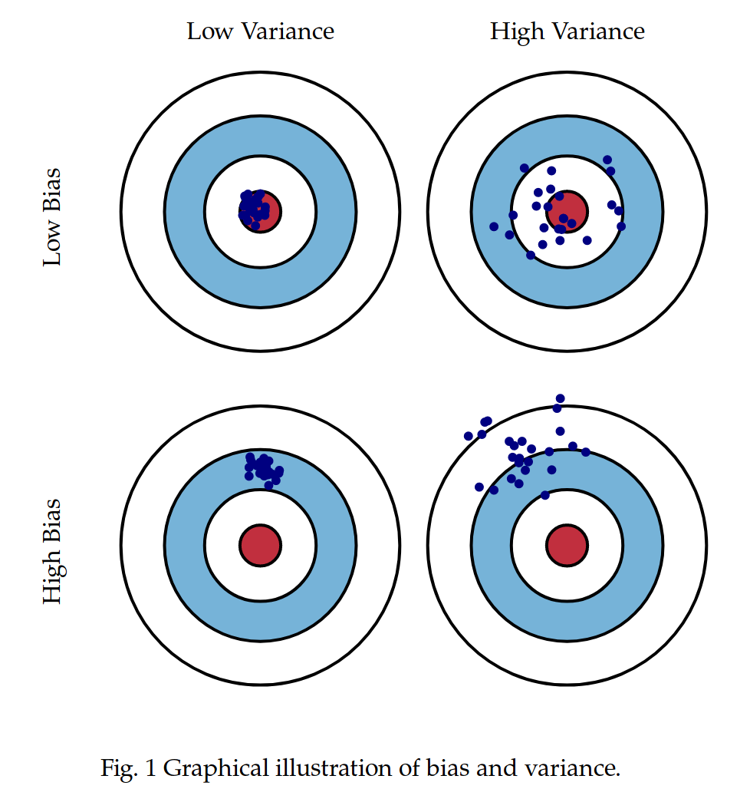

## Table of Contents
- [Embedding](#embedding)
- [Top-K, Top-P, and Temperature](#top-k-top-p-and-temperature)
- [XGBoost, Keras, and PyTorch](#xgboost-keras-and-pytorch)
- [Bias and Variance](#bias-and-variance)

## Embedding

**Embedding** is a technique used to convert data—like **words, sentences, images, or other types of content**—into **numerical vectors** (lists of numbers) that preserve the **semantic meaning** or important features of the data. These vectors can then be used by machine learning models for tasks like search, recommendation, classification, or question answering.

### 🔍 Why Use Embeddings?

Raw data like text or images can't be directly used in most ML models. Embeddings convert them into a **machine-understandable format**.

### 🧠 In NLP (Natural Language Processing)

For text, an embedding maps a word/sentence/document to a **dense vector** in a high-dimensional space where:

* Similar meanings → vectors are close together.
* Different meanings → vectors are far apart.

**Example:**

* `"king"` - `"man"` + `"woman"` ≈ `"queen"`
  This kind of relationship is captured using **word embeddings**.


### 💡 Common Use Cases

1. **Semantic Search** (e.g., Amazon Bedrock RAG):

   * Embed your documents and a user's query.
   * Find the most similar document vectors to the query vector.

2. **Recommendation Systems**:

   * Products, users, and actions are embedded.
   * Recommend based on vector similarity.

3. **Image or Audio Recognition**:

   * Images are embedded into feature vectors.
   * Similar images have similar vectors.

4. **RAG (Retrieval-Augmented Generation)**:

   * Use embeddings to retrieve relevant context from a knowledge base.
   * Pass that context to an LLM (like Claude, GPT) to generate an answer.


### 📦 Example: Sentence Embedding

```python
from sentence_transformers import SentenceTransformer
model = SentenceTransformer('all-MiniLM-L6-v2')

sentence = "Embedding is a way to represent meaning as a vector."
vector = model.encode(sentence)

print(vector.shape)  # (384,)
```

### 🧭 Embedding Models

* **OpenAI**: `text-embedding-ada-002`
* **Amazon Bedrock**: Supports Cohere, Titan Embeddings, etc.
* **SentenceTransformers**: Open-source, good for local inference

---

## Top-K, Top-P, and Temperature
For Generation - When using **Large Language Models (LLMs)** like GPT or Claude for generation, the parameters **Top-K**, **Top-P**, and **Temperature** control **how random or focused** the output is. Here's a breakdown:


### 🔧 What They Are

#### 1. **Temperature** (range: 0.0 – 2.0)

Controls how **random** the output is.

* `0.0` = deterministic (least randomness) (jc - temp more low, more cold, more stable. )
* `0.7` = balanced
* `>1.0` = more creative/unpredictable

**Use it when**:
* You want **more creativity** → higher temp (e.g., fiction writing, brainstorming)
* You want **more factual/consistent answers** → lower temp (e.g., legal summaries, coding)

#### 2. **Top-K Sampling**

Limits token choices to the **top K most likely** next words.
* `K=1` → always pick the most probable word (like greedy search)
* `K=40` → choose randomly from top 40 candidates

**Use it when**:
* You want to avoid rare, odd tokens
* Helps **focus the output** by cutting off low-probability noise

#### 3. **Top-P (a.k.a. Nucleus Sampling)**

Instead of picking top K tokens, **cumulatively selects tokens whose total probability(累积选择总概率) ≥ P**

* `P=1.0` → include all tokens (no filtering)
* `P=0.9` → only sample from tokens that together make up 90% of probability mass

**Use it when**:

* You want a **flexible balance between diversity and relevance**
* It adapts dynamically to how confident the model is


### 🎯 How to Choose — Quick Guide

| Goal                                 | Temperature | Top-P    | Top-K |
| ------------------------------------ | ----------- | -------- | ----- |
| **Precise answers (e.g. coding)**    | 0.2–0.5     | 0.8      | 20    |
| **Balanced (e.g. summarization)**    | 0.6–0.8     | 0.9      | 40    |
| **Creative writing / ideation**      | 0.9–1.2     | 0.95–1.0 | 50+   |
| **Maximum randomness (for variety)** | 1.3+        | 1.0      | 100+  |

You can **combine** them (e.g., use Top-P and Temperature together). If you set **Top-K and Top-P together**, the model picks from the **intersection** of both filters.

### When should use temperature, Top-K and Top-P

#### ✅ **Where Top-K, Top-P, and Temperature Are Used**

##### 🧠 **1. Text Generation Tasks**

These parameters **are mainly used in tasks where the model generates new text** — especially when **multiple plausible answers** exist.

Examples:

* ✅ **Story writing**
* ✅ **Chatbot replies**
* ✅ **Poetry/songwriting**
* ✅ **Creative coding**
* ✅ **Marketing copy**
* ✅ **RAG (e.g., Bedrock + Knowledge Base)**

💡 In these cases, you're balancing **coherence** vs. **creativity**.


##### ⚖️ **2. Summarization**

Used **sometimes**.

* For **concise, factual summarization**, use **low temperature** and maybe no Top-K/P.
* For **more abstract or creative summaries**, like "summarize in haiku," use higher randomness.

**Bottom line:**
🔸 You can use these settings to **control tone or creativity**, but **they're not required** for simple, factual summaries.


##### 🔍 **3. Classification**

❌ **Do not use Top-K, Top-P, or high Temperature.**

Classification tasks (like spam detection, sentiment analysis, topic labeling):

* Require **deterministic, consistent output**
* Work better with **zero randomness**
* Often use **logits or softmax probabilities** directly

➡️ Set: `temperature=0.0`, disable sampling → get repeatable, reliable outputs.


##### 🖼️ **4. Image Generation (e.g., DALL·E, Midjourney, SD)**

These **do not use Top-K or Top-P** like LLMs.

* Instead, they use **latent diffusion models**, where randomness is controlled via:

  * **Guidance scale** (creativity vs. prompt adherence)
  * **Noise seed**
  * **Sampling steps**

So in **image generation**, the "temperature" equivalent is more about **diffusion noise levels**, **prompt strength**, etc.

#### 🧠 Summary Table

| Task             | Uses Temp/Top-K/P?       | Notes                            |
| ---------------- | ------------------------ | -------------------------------- |
| Story generation | ✅ Yes                   | Key to control creativity        |
| Chat/Dialogue    | ✅ Yes                   | For tone variety                 |
| Summarization    | ⚠️ Sometimes             | Depends on style                 |
| Classification   | ❌ No                    | Use deterministic settings       |
| Image generation | ❌ No (different method) | Uses guidance scale, steps, seed |


## XGBoost, Keras, and PyTorch
**XGBoost, Keras, and PyTorch** are **frameworks/tools** that help developers, data scientists, and ML engineers **build, train, and deploy different types of models** to solve specific problems.

#### 🧰 Think of them like Toolkits:

Each one gives you different **tools** to build **models** that fit your data and goals.

| Tool / Framework | Helps You Build...               | Best For...                        |
| ---------------- | -------------------------------- | ---------------------------------- |
| **XGBoost**      | Gradient boosting decision trees | Tabular data (CSV), fast accuracy  |
| **Keras**        | Neural networks (via TensorFlow) | Quick prototyping, images, text    |
| **PyTorch**      | Custom deep learning models      | Research, NLP, vision, flexibility |


#### 🧠 They Let You “Leverage Models” To:

* **Classify** spam vs. not spam
* **Predict** house prices or stock trends
* **Generate** images or text
* **Summarize** documents
* **Translate** languages
* **Detect** objects in images
* **Forecast** future values (time series)


#### 🔍 Which to Use When?

| Your Goal                              | Use This Framework         |
| -------------------------------------- | -------------------------- |
| Predict values from a table (CSV)      | ✅ **XGBoost**              |
| Build a quick image classifier         | ✅ **Keras**                |
| Fine-tune a large language model       | ✅ **PyTorch**              |
| Experiment with new ML ideas           | ✅ **PyTorch**              |
| Build and deploy a production DL model | ✅ **Keras** or **PyTorch** |


#### 📌 Summary:

> These frameworks don't *do the work for you*, but they give you the tools to **define**, **train**, **tune**, and **run** machine learning models — each suited for different data types and use cases.


## Bias and Variance


