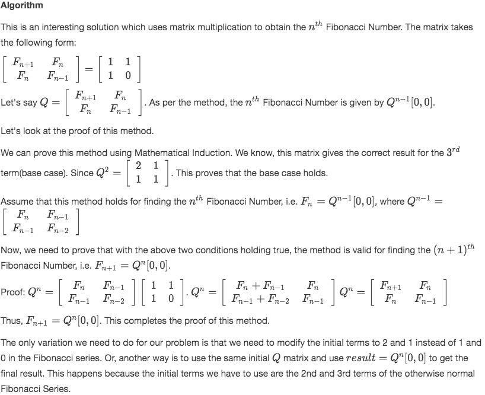
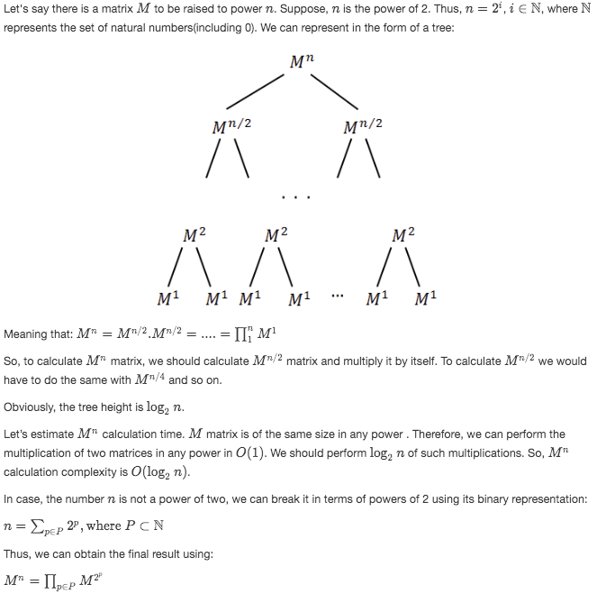
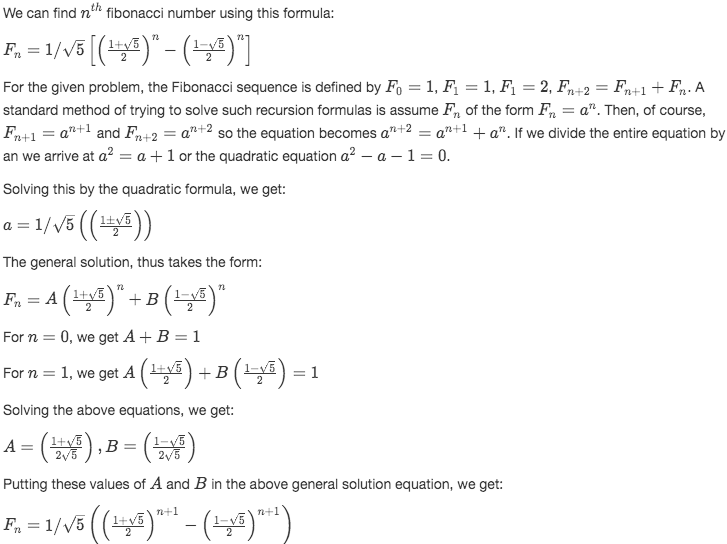

### Summary
You are climbing a stair case. It takes n steps to reach to the top.

Each time you can either climb 1 or 2 steps. In how many distinct ways can you climb to the top?

### Solution
#### Approach 1: Brute Force
##### Algorithm
In this brute force approach we take all possible step combinations i.e. 1 and 2, at every step. At every step we are calling the function
**climbStairs** for step 1 and step 2, and return the sum of returned values of both functions.

**climbStairs(i, n) = (i + 1, n) + climbStairs(i + 2, n)**
where ii defines the current step and nn defines the destination step.
```java
public class Solution {
    public int climbStairs(int n) {
        return climb_Stairs(0, n);
    }
    public int climb_Stairs(int i, int n) {
        if (i > n) {
            return 0;
        }
        if (i == n) {
            return 1;
        }
        return climb_Stairs(i + 1, n) + climb_Stairs(i + 2, n);
    }
}
```

##### Complexity Analysis
* Time complexity: O(2 ^ n). Size of recursion tree will be 2 ^ n.

Recursion tree for n=5 would be like this:


* Space complexity: O(n). The depth of the recursion tree can go upto n.

#### Approach 2: Recursion with Memoization
##### Algorithm

In the previous approach we are redundantly calculating the result for every step. 
Instead, we can store the result at each step in **_memo_** array and directly returning the result from the memo array whenever that function is called again.

In this way we are pruning recursion tree with the help of **_memo_** array and reducing the size of recursion tree upto n.

```java
public class Solution {
    public int climbStairs(int n) {
        int memo[] = new int[n + 1];
        return climb_Stairs(0, n, memo);
    }
    public int climb_Stairs(int i, int n, int memo[]) {
        if (i > n) {
            return 0;
        }
        if (i == n) {
            return 1;
        }
        if (memo[i] > 0) {
            return memo[i];
        }
        memo[i] = climb_Stairs(i + 1, n, memo) + climb_Stairs(i + 2, n, memo);
        return memo[i];
    }
}
```

##### Complexity Analysis
* Time complexity : O(n). Size of recursion tree can go upto n.
* Space complexity : O(n). The depth of recursion tree can go upto n.


#### Approach 3: Dynamic Programming
##### Algorithm
As we can see this problem can be broken into subproblems, and it contains the optimal substructure property i.e. its optimal solution can be constructed efficiently from optimal solutions of its subproblems, we can use dynamic programming to solve this problem.

One can reach i_th step in one of the two ways:
1. Taking a single step from (i - 1)^th step.
2. Taking a step of 2 from (i - 2)^th step.

so, the total number of ways to reach i^th is equal to sum of ways of reaching (i-1)^th step and ways of reaching (i - 2)^th step.

Let dp[i] denotes the number of ways to reach on i^th step:

**dp[i] = dp[i-1] + dp[i−2]**


```java
public class Solution {
    public int climbStairs(int n) {
        if (n == 1) {
            return 1;
        }
        int[] dp = new int[n + 1];
        dp[1] = 1;
        dp[2] = 2;
        for (int i = 3; i <= n; i++) {
            dp[i] = dp[i - 1] + dp[i - 2];
        }
        return dp[n];
    }
}
```
##### Complexity Analysis

* Time complexity : O(n). Single loop upto nn.
* Space complexity : O(n). **dp** array of size nn is used.

#### Approach 4: Fibonacci Number
##### Algorithm

In the above approach we have used **_dp_** array where dp[i] = dp[i-1] + dp[i−2]. 
it can be easily analysed that dp[i] is nothing but i^th fibonacci number.

**Fib(n) = Fib(n-1) + Fib(n-2)**

Now we just have to find n^th number of the fibonacci series having 1 and 2 their first and second term respectively.
i.e. Fib(1) = 1 and Fib(2) = 2.

```java
public class Solution {
    public int climbStairs(int n) {
        if (n == 1) {
            return 1;
        }
        int first = 1;
        int second = 2;
        for (int i = 3; i <= n; i++) {
            int third = first + second;
            first = second;
            second = third;
        }
        return second;
    }
}
```

##### Complexity Analysis

* Time complexity: O(n). Single loop upto nn is required to calculate n^th fibonacci number.
* Space complexity : O(1). Constant space is used.

#### Approach 5: Binets Method
##### Algorithm



```java
 public class Solution {
    public int climbStairs(int n) {
        int[][] q = {{1, 1}, {1, 0}};
        int[][] res = pow(q, n);
        return res[0][0];
    }
    public int[][] pow(int[][] a, int n) {
        int[][] ret = {{1, 0}, {0, 1}};
        while (n > 0) {
            if ((n & 1) == 1) {
                ret = multiply(ret, a);
            }
            n >>= 1;
            a = multiply(a, a);
        }
        return ret;
    }
    public int[][] multiply(int[][] a, int[][] b) {
        int[][] c = new int[2][2];
        for (int i = 0; i < 2; i++) {
            for (int j = 0; j < 2; j++) {
                c[i][j] = a[i][0] * b[0][j] + a[i][1] * b[1][j];
            }
        }
        return c;
    }
}
```
##### Complexity Analysis
* Time complexity : O(log n). Traversing on log n bits
* Space complexity : O(1). Constant space is used.

Proof of Time Complexity:



This is the method we've used in our implementation. Again, the complexity remains O(log2 ^ n) as we have limited the number of multiplications to O(log 2 ^ n).


#### Approach 6: Fibonacci Formula
##### Algorithm


```java
public class Solution {
    public int climbStairs(int n) {
        double sqrt5=Math.sqrt(5);
        double fibn=Math.pow((1+sqrt5)/2,n+1)-Math.pow((1-sqrt5)/2,n+1);
        return (int)(fibn/sqrt5);
    }
}
```

##### Complexity Analysis
* Time complexity : O(logn). powpow method takes **log n** time.
* Space complexity : O(1). Constant space is used.