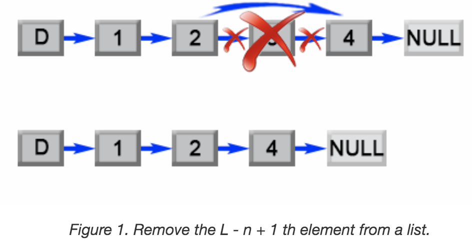

#### Remove Nth Node From End of List
Solution
Approach 1: Two pass algorithm
Intuition

We notice that the problem could be simply reduced to another one : Remove the (L - n + 1) th node from the beginning in the list , where LL is the list length. This problem is easy to solve once we found list length LL.

Algorithm

First we will add an auxiliary "dummy" node, which points to the list head. The "dummy" node is used to simplify some corner cases such as a list with only one node, or removing the head of the list. On the first pass, we find the list length LL. Then we set a pointer to the dummy node and start to move it through the list till it comes to the (L - n)(L−n) th node. We relink next pointer of the (L - n)(L−n) th node to the (L - n + 2)(L−n+2) th node and we are done.



```java
public ListNode removeNthFromEnd(ListNode head, int n) {
    ListNode dummy = new ListNode(0);
    dummy.next = head;
    int length  = 0;
    ListNode first = head;
    while (first != null) {
        length++;
        first = first.next;
    }
    length -= n;
    first = dummy;
    while (length > 0) {
        length--;
        first = first.next;
    }
    first.next = first.next.next;
    return dummy.next;
}
```