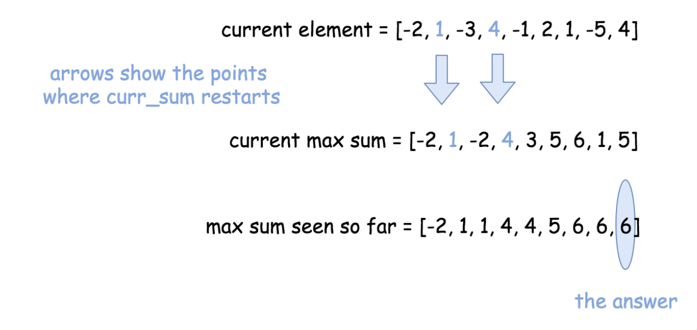

### Summary of Top Interview Question - Easy

#### 1. Array
* in-place: `nums[:] = equation`, `list.sort()`
* sorted list to new: `new_list = sorted(list)` or `list[::-1]`
* set(list) remove the duplicate items
* slice of List: 
  - nums[len(nums) - k : len(nums)]: from k to the end
  - numsnums[0:len(nums) - k]: from 0 to k(not include k)
* Counter. `from collections import Counter`
  - new_counter = Counter(nums).
  - for k, v in new_counter.items()
  - for k in new_counter.keys()
  - for val in new_counter.values()
  - new_counter.get(key)
* Set. only set has intersection. 
  - Set(list).intersection(list or set)
* `List[~i] = List[length - 1 - i]`. 
  - eg. `P = [0,1,2,3,4,5]`, `P[~1] = 4`.
* create one-dimensional List simple way
  - `new_list = 5 * [0]` == `[0,0,0,0,0] `
  - `maxtrix = 5 * [None for _ in range(5)]`
* create two-dimensional List simple way:
  - `new_list = 5 * [[0]]` == `[[0],[0],[0],[0],[0]]`
  - eg matrix[5][5]: `maxtrix = 5 * [[None for _ in range(5)]] or
  - `matrix = 5 * [[0 for _ in range(5)]]
  - Improve the space occupies, None is better than 0.
* if need matrix[5][5], example here: 118.pascalsTriangle
  - don't inital it with None or 0 first, and matrix[i][j] = new_list 
  - append the list to matrix one by one
  - because, python will search the address of index points to, and delete the connection between of them, and assign new space for it.
  - it consumes a lot of time and also the space. in the memory the dis-connected list still in memory.
* Filter, Lambda, Reduce and Map
  - Lambda:
    - `x = lambda y: y * y` for map, reduce. `lambda y: y > 0` for filter.
  - Map:
    - `map(function_to_apply, list_of_inputs)`: applies a function to all the items in an input_list.
    - function_to_apply could be a lambda or def func. list_of_inputs is a list.
    - `squared = list(map(lambda x: x**2, [1,2,3]))` 
    - ```python
        def multiply(x):
            return (x*x)
        def add(x):
            return (x+x)
        
        funcs = [multiply, add]
        for i in range(5):
            value = list(map(lambda x: x(i), funcs))
            print(value)
        
        # Output:
        # [0, 0]
        # [1, 2]
        # [4, 4]
        # [9, 6]
        # [16, 8]
        ```
    - list_of_inputs in map, which could be a list o function. the value will loop in the list of func. 
    - if want to loop value(i in above), should in another loop.
  - Filter:
    - filter creates a list of elements for which a function returns true.
    - `less_than_zero = list(filter(lambda x: x < 0, [-1,-2,2,1]))`
  - Reduce:
    - is a really useful function for performing some computation on a list and returning the result. It applies a rolling computation to sequential pairs of values in a list
    - ```python
        from functools import reduce
        product = reduce((lambda x, y: x * y), [1, 2, 3, 4])
        
        # output:
        # product = 24
      ```
* accumulate() get prefix sums. `accumulate_prefix = [0] + list(accumulate(nums))` the `[0]` to keep the length of sum is the same.

#### 2. String
* string reverse. eg: `int_str="123"; int_str=int_str[::-1]"`, does not work for integer.
* `string.ascii_lowercase`, return lowercase of accii chars.
* `s.isalnum()`, boolean, is number or character.
* `s.find(sub_str)` returns from 0 to n. if not find, returns -1. 
* `s.index(sub_str)` return from 0 to n, will raise error if could not find.

#### 3. Linked List
* remove a node of linked list, just let the `node.next = xx.next`. 
* remove a node of linked list and return it, make sure create a dummy node = head. head in the loop to remove node, return the dummy.
* end of a linked list, just let the end of `node.next = None`
* Reverse a Linked List, let the node.next = previous_node.
```python
def reverseList(self, head: ListNode) -> ListNode:
        cur_node = head
        prev_node = None
        while cur_node:
            next_node = cur_node.next
            cur_node.next = prev_node
            prev_node = cur_node
            cur_node = next_node

        return prev_node
```

#### 4. Trees
#### 6. Dynamic Programming
* 动态规划算法的两种形式 - 核心是记住已经求过的解
  - 自顶向下的备忘录法
  - 自底向上
eg:
```python
Fibonacci (n) = 1;   n = 0
Fibonacci (n) = 1;   n = 1
Fibonacci (n) = Fibonacci(n-1) + Fibonacci(n-2)
```
* 无论是DP还是暴力，我们的算法都是在可能解空间内，寻找最优解。来看钞票问题。**DP的核心思想：尽量缩小可能解空间**
  - 暴力做法是枚举所有的可能解，这是最大的可能解空间。
  - DP是枚举有希望成为答案的解。这个空间比暴力的小得多。


#### Other
* `2**31 - 1` or `math.pow(2,31) - 1` for 32-bit system.


#### Brute Force
which means loop each of item, probably will loop in a second for x in range(n).
and try to find the required result. it does step by step. 
sometimes, it has **time Limit Execeeded issue**. its not always accepted..


#### sliding window
this means it has left and right point to the beginning of a list. the right will slide to right, 
also the left will slide to the right as long as some requirement meets.
[pexampe](./top_interview_question/3.hard/159.longestSubstringWithatMostTwoDistinctCharacters.py)


#### Reservoir Sampling.
* this is not high frequency question, read the detail [here](./top_interview_question/2.medium/398.randomPickIndex.py)


Must to understand:
#### Prefix Sums
1. [SubArrary Sum Equals K](./top_interview_question/3.hard/560.subarraySumEqualsK.py) 
2. [SubArray Sum Divisible By K](./top_interview_question/2.medium/974.subarraySumsDivisibleByK.py)

#### Greedy
**Intuition**
The problem to find maximum(or minimum) element (or sum) with a single array as the input is a good candidate to 
be solved by the greedy approach in linear time.
```
Pick the locally optimal move at each step, and that will lead to the globally optimal solution.
```

the algorithm is general and straightforward: **iterate over the array and update each step and standard set 
for such problems**:
* Current element
* Current local maximum sum (at this given point)
* Global maximum sum seen so far.



1. [Maximum Subarray](./top_interview_question/1.easy/1.Array/53.maximumSubarray.py)