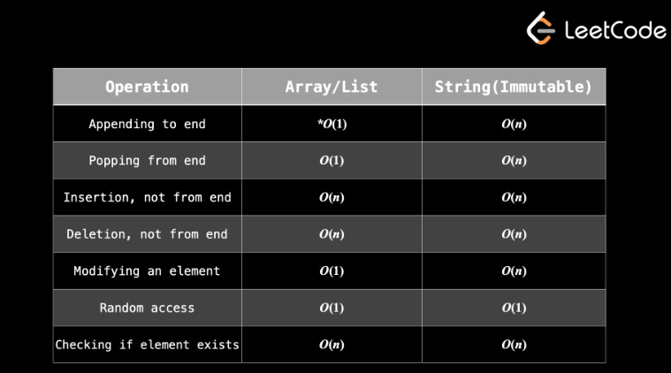

## Chapter 2 -  Array and Strings

As mentioned before, a majority of algorithm problems will involve an array or string. They are extremely versatile data structures and it's impossible to list all the relevant problem-solving techniques in one article. In the next few articles, we'll go over the most common techniques. But first, let's take a quick look at the complexity of array and string operations

### Why is the time complexity of Python's list.append() method O(1)?
As seen in the documentation for TimeComplexity, Python's list type is implemented using an array.

So if an array is being used and we do a few appends, eventually you will have to reallocate space and copy all the information to the new space. After all that, how can it be O(1) worst case?

#### Answer:
It's [amortized(摊销)](https://en.wikipedia.org/wiki/Amortized_analysis) O(1), not O(1).

Let's say the list reserved size is 8 elements and it doubles in size when space runs out. You want to push 50 elements.

The first 8 elements push in O(1). The nineth triggers reallocation and 8 copies, followed by an O(1) push. The next 7 push in O(1). The seventeenth triggers reallocation and 16 copies, followed by an O(1) push. The next 15 push in O(1). The thirty-third triggers reallocation and 32 copies, followed by an O(1) push. The next 31 push in O(1). This continues as the size of list is doubled again at pushing the 65th, 129th, 257th element, etc..

So all of the pushes have O(1) complexity, we had 64 copies at O(1), and 3 reallocations at O(n), with n = 8, 16, and 32. Note that this is a geometric series and asymptotically equals O(n) with n = the final size of the list. That means the whole operation of pushing n objects onto the list is O(n). If we amortize that per element, it's O(n)/n = O(1).

