## Reversing a linked list

While reversing a linked list is a common interview problem in itself, it is also a technique that can be a step in solving different problems. Elegantly performing the reversal requires a good understanding of how to move pointers around, which we will aim to achieve in this article.

Imagine that we have a linked list **1 -> 2 -> 3 -> 4**, and we want to return **4 -> 3 -> 2 -> 1**. Let's say we keep a pointer curr that represents the current node we are at. Starting with **curr** at the **1**, we need to get the **2** to point to **curr**. The problem is, once we iterate (**curr = curr.next**) to get to the 2, we no longer have a pointer to the 1 because it is a singly linked list. To get around this, we can use another pointer **prev** that tracks the previous node.

At any given node curr, we can set **curr.next = prev** to switch the direction of the arrow. Then, we can update prev to be curr in preparation for the next node. However, if we change **curr.next**, how can we get to the next node? We can use a temporary variable **nextNode** to point to the next node before changing any of the other pointers.

```python
def reverse_list(head):
    prev = None
    curr = head
    while curr:
        next_node = curr.next # first, make sure we don't lose the next node
        curr.next = prev      # reverse the direction of the pointer
        prev = curr           # set the current node to prev for the next node
        curr = next_node      # move on
        
    return prev
```

The time complexity of this algorithm is O(n) where n is the number of nodes in the linked list. The while loop runs n times, and the work done at each iteration is O(1). The space complexity is O(1) as we are only using a few pointers.

This exercise is a great one to practice operations on a linked list because it demonstrates the thought process needed. Solutions to linked list problems are usually simple and elegant - to get to them, think about what you need, and solve the problem one step at a time. In this example, we had the following thought process:

1. When we are at a node curr, we need to set its next pointer to the node we were at previously.
    - Use a prev pointer to track the previous node.
2. The prev pointer needs to also update every iteration.
    - Set prev = curr, but only after changing curr.next.
3. If we set curr.next = prev, then we lose the reference to curr.next.
    - Use nextNode to keep a reference to curr.next.

Let's look at another example.
```html
Example: 24. Swap Nodes in Pairs

Given the head of a linked list, swap every pair of nodes. For example, given a linked list 1 -> 2 -> 3 -> 4 -> 5 -> 6, return a linked list 2 -> 1 -> 4 -> 3 -> 6 -> 5.
```
Again, let's break down what we need to do step by step, and how we can accomplish it. Consider each pair of nodes as A -> B.

Starting with head at node A, we need node B to point here.

We can accomplish this by doing head.next.next = head
However, if we change B.next, we will lose access to the rest of the list.

Before applying the change in step 1, save a pointer nextNode = head.next.next.

>head.next.next is different in steps 1 and 2. When it is before the assignment (=), it is changing head.next's next node. When it is after the assignment, it is referring to head.next's next node.

We have B pointing to A, but now we also need to change where A is pointing. If we move on now, we will lose the reference to A.

Save A in another pointer with prev = head.
To iterate to the next pair, do head = nextNode.
Once we move onto the next pair, say C -> D, we need A to point to D.

Now that head is at C, and prev is at A, we can do prev.next = head.next.
After the swap, what do we return? The original 2nd node (the original head.next). How do we keep a reference to this?

Before running through all the swapping logic, save dummy = head.next.
What if there is an odd number of nodes? We don't want to end on A <-> B C, we would be missing a reference to the last node and have an infinite cycle as well.

Before moving on to the next pair, avoid infinite cycles by doing head.next = nextNode before moving onto the next pair. That way, we have B -> A -> C.

**To summarize the steps:**
1. Performs an edge swap from A -> B -> C to A <-> B C.
2. Make sure we can still access the rest of the list beyond the current pair
3. Now that A <-> B is isolated from the rest of the list, save a pointer to A to connect it with the rest of the list later.
4. Connect the previous pair to the rest of the list. In this case connecting A -> D.
5. Use a dummy pointer to keep a reference to what we want to return.
6. Avoid cycles by handling the case when there's an odd number of nodes.

```python
class Solution:
    def swapPairs(self, head: ListNode) -> ListNode:
        # Check edge case: linked list has 0 or 1 nodes, just return
        if not head or not head.next:
            return head

        dummy = head.next               # Step 5
        prev = None                     # Initialize for step 3
        while head and head.next:
            if prev:
                prev.next = head.next   # Step 4
            prev = head                 # Step 3

            next_node = head.next.next  # Step 2
            head.next.next = head       # Step 1

            head.next = next_node       # Step 6
            head = next_node            # Move onto the next pair

        return dummy
```
more detail check [m0024_SwapNodesInParis.py](./m0024_SwapNodesInParis.py)
Steps:
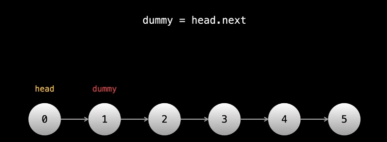
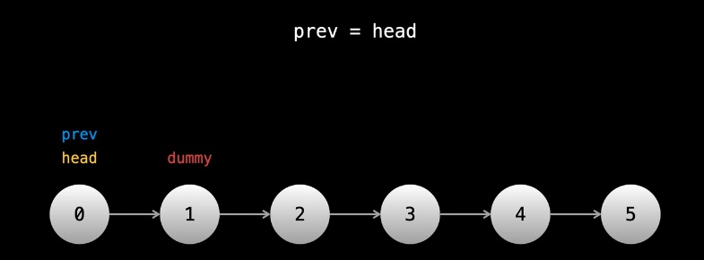
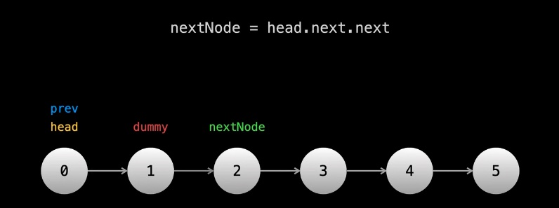


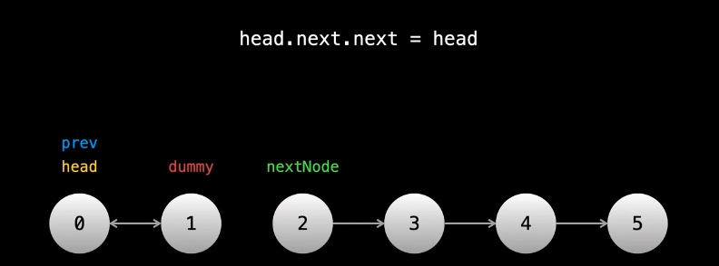
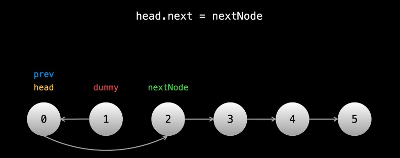
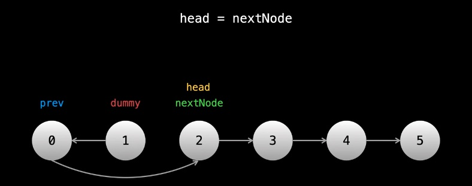
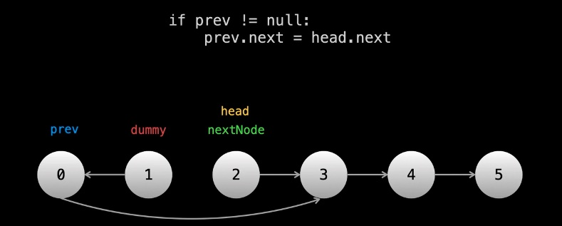
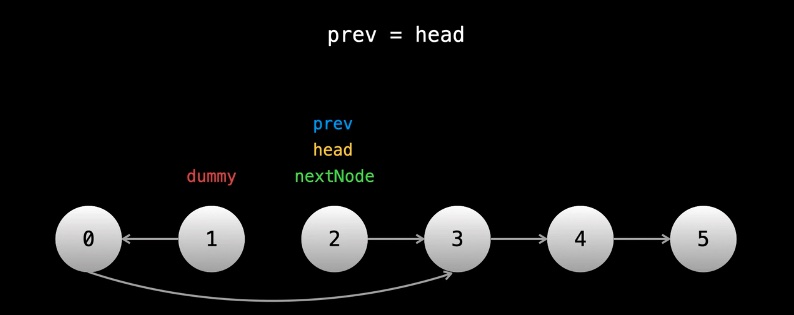
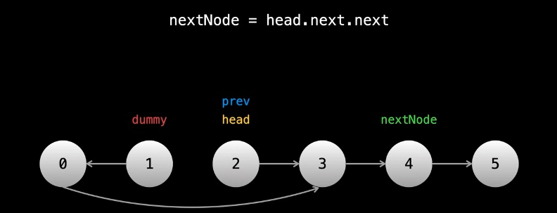
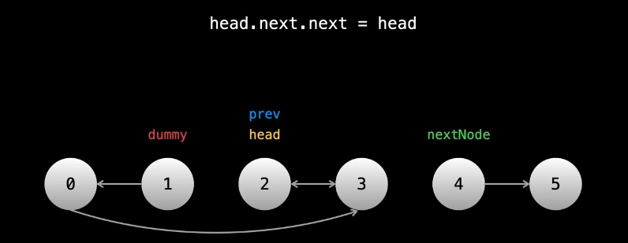
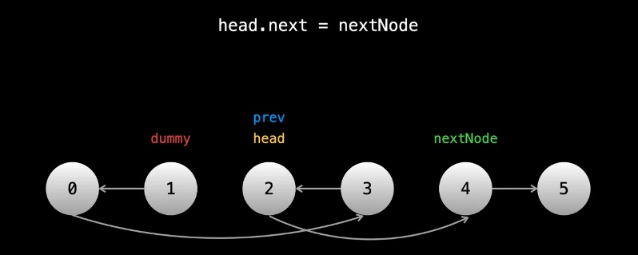
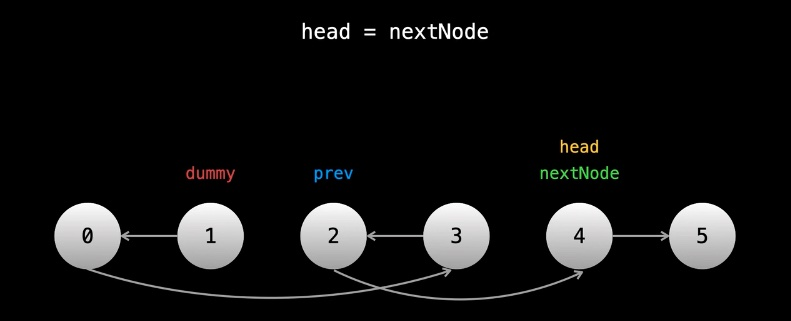
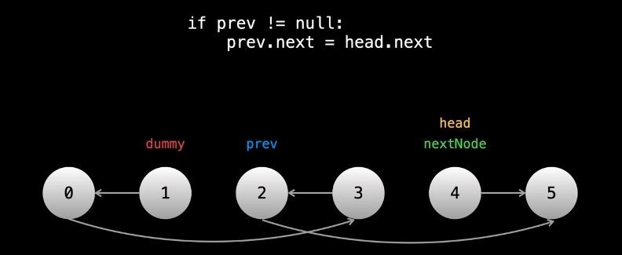
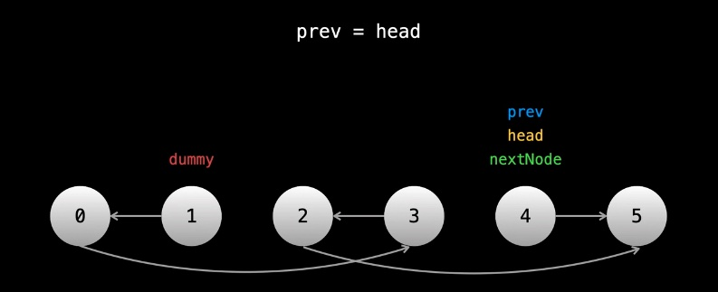
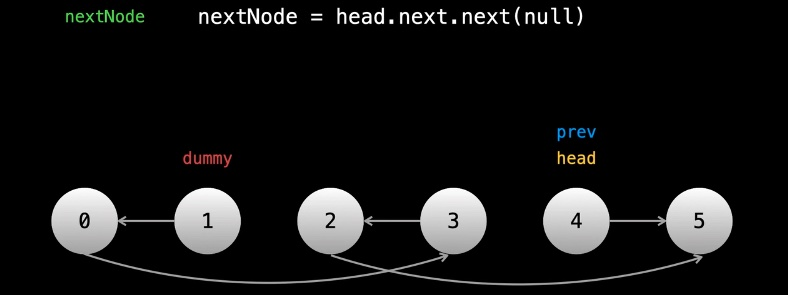
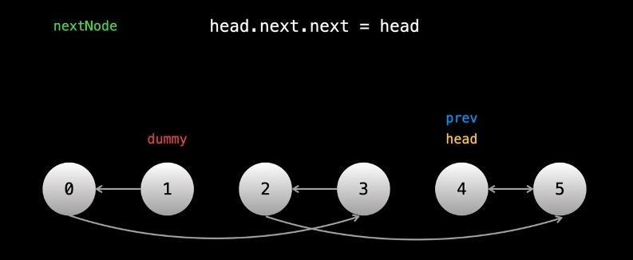
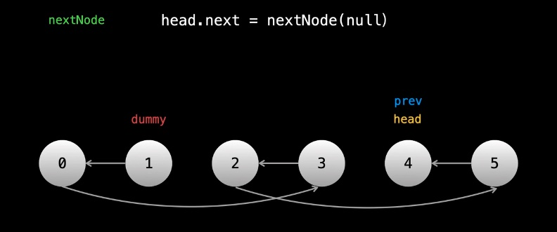
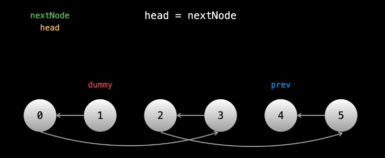
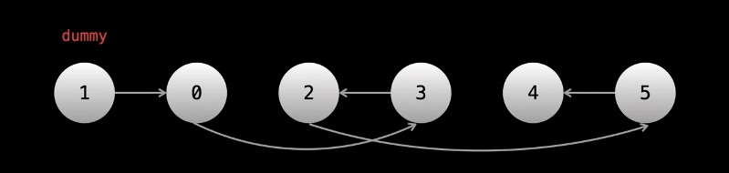
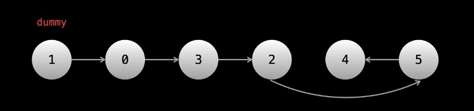
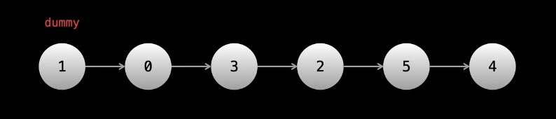
